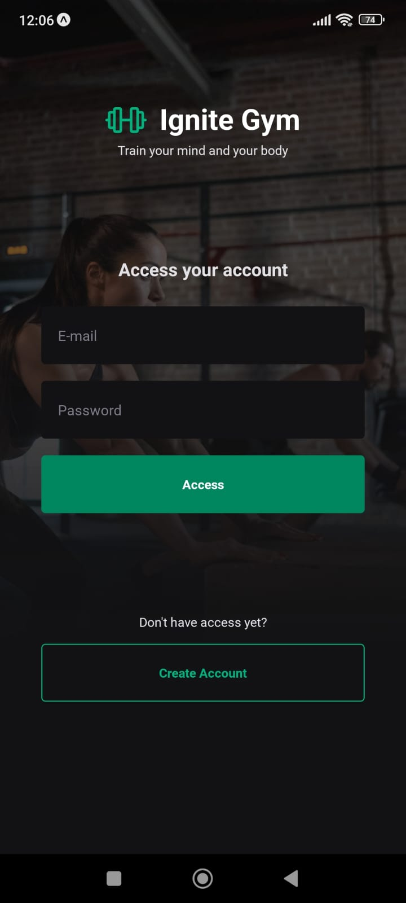
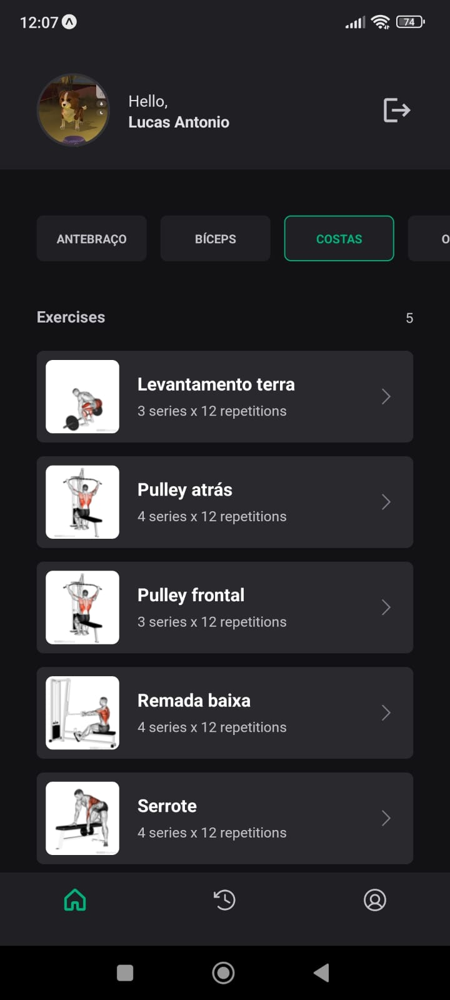
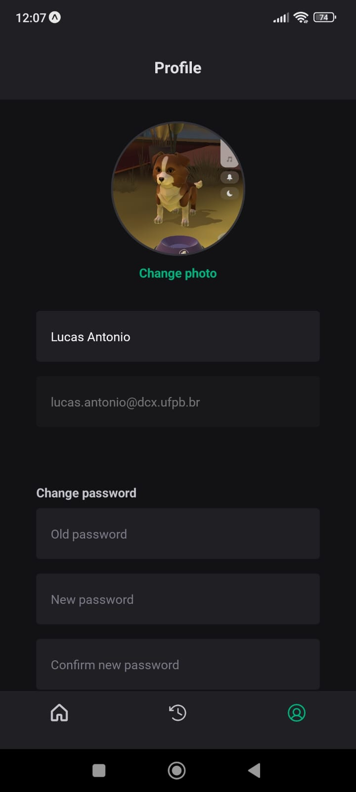

<div align="center" style="padding-bottom:30px; background:transparent">
    
  
  
</div>

## 💻 Project - IgniteGym

IgniteGym is to practice fundamentals in React Native. An application consuming an API to populate the gym exercises, authentication, and authorization, which is used to mark the exercises you have done in the gym that day.

## 🚀 Technologies used

- [React Native](https://reactnative.dev/)
- [Typescript](https://www.typescriptlang.org)
- [Expo](https://expo.dev/)
- [TypeScript](https://www.typescriptlang.org/)
- [Async Storage](https://docs.expo.dev/versions/latest/sdk/async-storage/)
- [Native Base](https://nativebase.io/)
- [React Hook Form](https://www.react-hook-form.com/)
- [React Navigation](https://reactnavigation.org/docs/getting-started/)
- [Yup](https://www.npmjs.com/package/yup)
- [Axios](https://www.npmjs.com/package/react-native-axios)

### Getting Started

Clone the project repository
[https://github.com/LucasAnP/IgniteGym.git](https://github.com/LucasAnP/IgniteGym.git)

Access the project directory

```
cd IgniteGym
```

Access the BACKEND directory 

```
cd backend
npm i
npm start
```

Access the Mobile directory 

```
cd mobile
npm i
npx expo start
```

## 📄 License

[MIT LICENSE](https://opensource.org/license/mit/)
